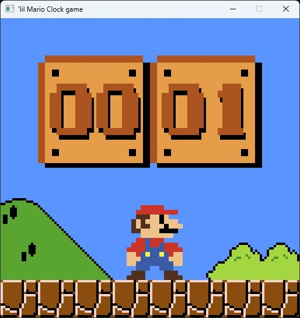

# ClockGameEngine
Simple, tile based game engine written in C++, uses SDL2 to render. 

Was mainly written for my ESP8266 based [Mario Clock](https://github.com/notisrac/mario_clock) 

## Features
 - Tile rendering
 - Object management
 - Input handling
 - Event management

## TODO
 - Collision detection
 - Debug text print to the renderer [https://thenumb.at/cpp-course/sdl2/07/07.html](https://thenumb.at/cpp-course/sdl2/07/07.html)
 - Optimize variable size, to reduce memory footprint

## Other
Images were converted to C arrays using the [File to C style array converter](https://notisrac.github.io/FileToCArray/) 
 

